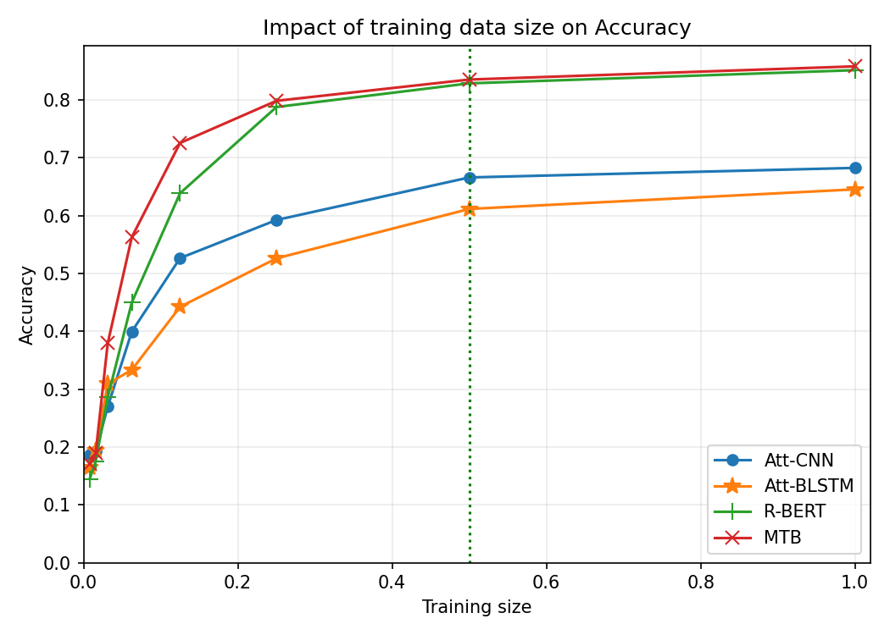
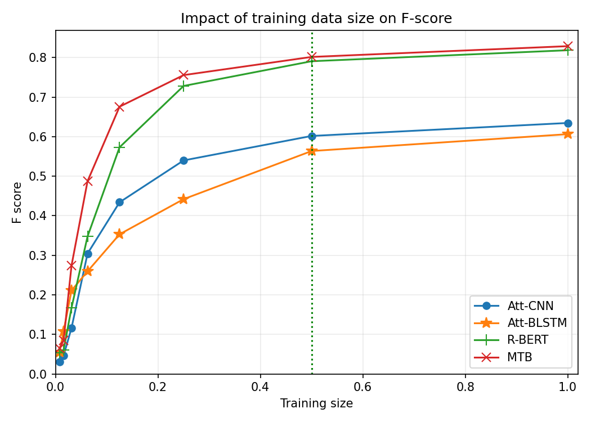

# Finding the Sweet Spot

Code for the paper:

> **Finding the Sweet Spot: An Empirical Study on Dataset Size, Performance, and Efficiency in Relation Extraction**  
> Sohrab Pirhadi, Babak Niroomand, Ebrahim Ansari  
> Institute for Advanced Studies in Basic Sciences (IASBS)

We study how relation-extraction accuracy and F-score scale with training-set size on SemEval-2010 Task 8. Eight nested training subsets (SE.1–SE.8) are sampled from the official 8,000 training instances; four models are trained on each subset and scored on the fixed 2,717-instance test set.

Paper PDF: [paper.pdf](paper.pdf)

## Methods

### Dataset and subsets

SemEval-2010 Task 8 is a 19-way relation classification benchmark (18 directed relations + `Other`). Training subsets follow the paper’s Algorithm 1: for each fraction \(X \in \{1/128,\ldots,1\}\), draw a uniform random sample of size \(X\cdot|SE|\) with a fixed seed. Subset index files under `data/processed/subsets/` freeze that sampling so runs stay aligned with Table I.

### Models

| Model | Idea | Code |
| ----- | ---- | ---- |
| Att-CNN | Word + POS + position embeddings → CNN → entity-aware attention → MLP | `models/att_cnn.py` |
| Att-BiLSTM | Embeddings → BiLSTM → attention → softmax | `models/att_bilstm.py` |
| R-BERT | BERT with entity markers; concat `[CLS]` + entity-span averages | `models/rbert.py` |
| MTB | BERT entity-marker head (supervised EM; no Wikipedia MTB pretraining) | `models/mtb.py` |

Hyperparameters live in `configs/`. Att-CNN / Att-BiLSTM use `word2vec-google-news-300` (via gensim) unless `--skip-embeddings` is set. R-BERT and MTB fine-tune `bert-base-uncased`.

### Metrics

Macro Accuracy, Precision, Recall, and F-score on the official test set (19-way), matching the reporting in the paper.

## Pipeline


Entry point: `run_experiments.py`

| Stage | Command | What it does |
| ----- | ------- | ------------ |
| Data | `python run_experiments.py --stage data` | Download, parse, sample subsets, write Table I |
| Train | `python run_experiments.py --stage train` | Train selected models/subsets |
| Tables | `python run_experiments.py --stage tables` | Rebuild Table II and Fig. 1–2 from saved metrics |
| Full | `python run_experiments.py` | Data → train → tables |

Examples:

```bash
python run_experiments.py --stage train --models rbert --subsets SE.8
python run_experiments.py --stage train --models att_cnn att_bilstm --device cuda
python run_experiments.py --quick   # short debug run
```

A full 4×8 sweep usually takes several hours on a modern NVIDIA GPU. Published metrics under `results/metrics/` let you regenerate tables/figures without retraining.

## Setup

- Python 3.10+
- PyTorch (CUDA recommended)

```bash
pip install torch --index-url https://download.pytorch.org/whl/cu124
pip install -r requirements.txt
```

```bash
python -c "import torch; print(torch.__version__, torch.cuda.is_available())"
```

## Table I — Training subsets

| Dataset Notation | Portion | Number of instances |
| ---------------- | ------- | ------------------: |
| SE.1 | 1/128 | 62 |
| SE.2 | 1/64 | 125 |
| SE.3 | 1/32 | 250 |
| SE.4 | 1/16 | 500 |
| SE.5 | 1/8 | 1,000 |
| SE.6 | 1/4 | 2,000 |
| SE.7 | 1/2 | 4,000 |
| SE.8 | 1 | 8,000 |

Source files: [table1_subsets.md](results/tables/table1_subsets.md) · [CSV](results/tables/table1_subsets.csv) · [LaTeX](results/tables/table1_subsets.tex)

## Table II — Test performance

Reproduced results (Accuracy / Precision / Recall / F-score) on SE.1–SE.8:

| Classification Model | Performance Metric | SE.1 | SE.2 | SE.3 | SE.4 | SE.5 | SE.6 | SE.7 | SE.8 |
| -------------------- | ------------------ | ---: | ---: | ---: | ---: | ---: | ---: | ---: | ---: |
| Att-CNN | Accuracy | 0.1862 | 0.1921 | 0.2698 | 0.3997 | 0.5267 | 0.5926 | 0.6662 | 0.6827 |
| Att-CNN | Precision | 0.0197 | 0.0659 | 0.1349 | 0.3254 | 0.4823 | 0.5806 | 0.6525 | 0.6845 |
| Att-CNN | Recall | 0.0729 | 0.0744 | 0.1593 | 0.3026 | 0.4285 | 0.5185 | 0.5886 | 0.6153 |
| Att-CNN | F-score | 0.0310 | 0.0458 | 0.1165 | 0.3044 | 0.4340 | 0.5398 | 0.6017 | 0.6345 |
| Att-BiLSTM | Accuracy | 0.1653 | 0.1943 | 0.3092 | 0.3335 | 0.4424 | 0.5263 | 0.6117 | 0.6456 |
| Att-BiLSTM | Precision | 0.0498 | 0.1244 | 0.2220 | 0.2754 | 0.3870 | 0.4779 | 0.5822 | 0.6268 |
| Att-BiLSTM | Recall | 0.1031 | 0.1198 | 0.2186 | 0.2635 | 0.3406 | 0.4227 | 0.5570 | 0.5961 |
| Att-BiLSTM | F-score | 0.0549 | 0.1075 | 0.2111 | 0.2594 | 0.3531 | 0.4419 | 0.5636 | 0.6062 |
| R-BERT | Accuracy | 0.1446 | 0.1756 | 0.2860 | 0.4501 | 0.6389 | 0.7880 | 0.8289 | 0.8517 |
| R-BERT | Precision | 0.0533 | 0.1615 | 0.2127 | 0.4953 | 0.6704 | 0.7655 | 0.7909 | 0.8116 |
| R-BERT | Recall | 0.0790 | 0.0790 | 0.1836 | 0.3246 | 0.5540 | 0.7235 | 0.7944 | 0.8274 |
| R-BERT | F-score | 0.0534 | 0.0599 | 0.1675 | 0.3477 | 0.5731 | 0.7281 | 0.7906 | 0.8184 |
| MTB | Accuracy | 0.1711 | 0.1895 | 0.3795 | 0.5631 | 0.7258 | 0.7987 | 0.8355 | 0.8583 |
| MTB | Precision | 0.0685 | 0.1629 | 0.3249 | 0.5134 | 0.7199 | 0.7728 | 0.7983 | 0.8213 |
| MTB | Recall | 0.0923 | 0.1022 | 0.2922 | 0.4854 | 0.6620 | 0.7535 | 0.8082 | 0.8380 |
| MTB | F-score | 0.0648 | 0.0842 | 0.2743 | 0.4874 | 0.6757 | 0.7555 | 0.8015 | 0.8287 |

Source files: [table2_performance.md](results/tables/table2_performance.md) · [CSV](results/tables/table2_performance.csv) · [LaTeX](results/tables/table2_performance.tex)  
Paper-reported numbers: [table2_paper.md](results/tables/table2_paper.md)

## Figures

Green dotted line marks training fraction 0.5 (diminishing-returns threshold used in the paper).

### Figure 1 — Accuracy vs. training size



### Figure 2 — F-score vs. training size



## Repository layout

```
.
├── configs/                 # default + per-model hyperparameters
├── data/
│   ├── raw/                 # SemEval download (gitignored)
│   └── processed/subsets/   # SE.1–SE.8 index files (tracked)
├── models/                  # Att-CNN, Att-BiLSTM, R-BERT, MTB
├── src/                     # data, training, eval, plots
├── results/
│   ├── figures/             # Fig. 1–2
│   ├── tables/              # Table I–II
│   └── metrics/             # per-run JSON
├── paper.pdf
├── run_experiments.py
├── requirements.txt
└── LICENSE
```

## Reproducibility

- Default seed: `42` (`configs/default.yaml`)
- Seeds cover Python, NumPy, PyTorch, CUDA, Transformers, and DataLoader workers
- Subset JSON files lock Algorithm 1 sampling
- MTB here is supervised BERT EM fine-tuning, not full unsupervised Matching-the-Blanks pretraining

## Citation

```bibtex
@INPROCEEDINGS{10967456,
  author={Pirhadi, Sohrab and Niroomand, Babak and Ansari, Ebrahim},
  booktitle={2025 29th International Computer Conference, Computer Society of Iran (CSICC)}, 
  title={Finding the Sweet Spot: An Empirical Study on Dataset Size, Performance, and Efficiency in Relation Extraction}, 
  year={2025},
  doi={10.1109/CSICC65765.2025.10967456}}

```

Please also cite SemEval-2010 Task 8 and the original Att-CNN, Att-BiLSTM, R-BERT, and MTB papers.

## Acknowledgements

Built on SemEval-2010 Task 8 (Hendrickx et al., 2010), Att-CNN (Shen & Huang, COLING 2016), Att-BiLSTM (Zhou et al., ACL 2016), R-BERT (Wu & He, CIKM 2019), and Matching the Blanks (Baldini Soares et al., ACL 2019).

## License

MIT — see [LICENSE](LICENSE). SemEval-2010 Task 8 remains under its original terms.
